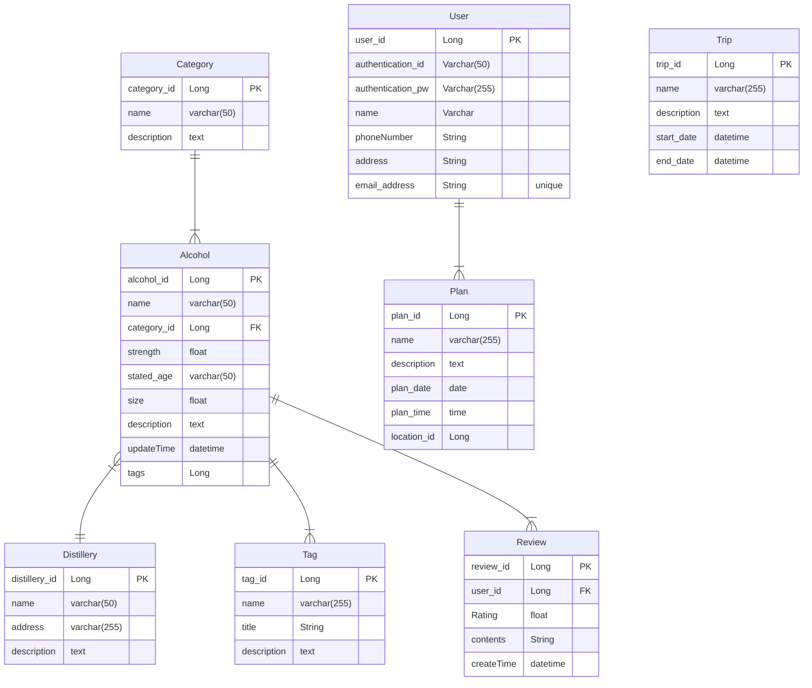

# ERD

```mermaid
erDiagram
User {
    user_id Long PK
    authentication_id Varchar(50)
    authentication_pw Varchar(255)
    name Varchar
    phoneNumber String
    address String
    email_address String "unique"
}

Alcohol{
	alcohol_id Long PK
	name varchar(50)
	category_id Long FK
	strength float
	stated_age varchar(50)
	size float
	description text
	updateTime datetime
	tags Long
}

Category{
	category_id Long PK
	name varchar(50)
	description text
}

Distillery{
	distillery_id Long PK
	name varchar(50)
	address varchar(255)
	description text
}

Review{
	review_id Long PK
	user_id Long FK
	Rating float 
	contents String
	createTime datetime
}
Tag{
	tag_id Long PK
	name varchar(255)
	title String
	description text
}
Trip{
	trip_id Long PK
	name varchar(255)
	description text
	start_date datetime
	end_date datetime
}
Plan{
	plan_id Long PK
	name varchar(255)
	description text
	plan_date date
	plan_time time
	location_id Long
}

User ||--|{ Plan : ""
Alcohol }|--|| Distillery : ""
Alcohol ||--|{ Tag : ""
Alcohol ||--|{ Review : ""
Category ||--|{ Alcohol : ""
```